# Proyecto MesApp 🚀

- Sistema de administración de pedidos y generador de menú por medio de códigos QR

## Pre-requisitos 📋

Se requiere la previa instalación del framework Vue con las librerías Vuex, Vue-Router, Firebase, Vuetify y Cypress

# Hito 1 📦

## Maquetación

El primer Hito consiste en la maquetación del proyecto, para lo cual, primero es necesario definir el tema y orientar el diseño que tendrá la interfaz. En esta etapa, se montará el entorno de desarrollo necesario y se trabajará de una forma más bien estática, generando las vistas y componentes que formarán parte de la aplicación.

1. Descripción del proyecto: Descripción breve, propósito de la aplicación y usuarios a los que apunta
2. Guía de estilos: Una breve guía de estilos que indique tipografías utilizadas (recomendado
   utilizar desde Google fonts), tamaños de texto, colores seleccionados y que elementos harán
   uso de ellas.
3. Guía de instalación del proyecto: Indicar los requisitos necesarios, si se utiliza Webpack o Parcel, si es necesario instalar dependencias extra dentro de un directorio (Por ejemplo, para las Cloud Functions). Registrar paso a paso el proceso de instalación.
4. Rutas de acceso: Indicar la ruta en donde puede ser encontrada la aplicación

**Descripción y proósito del proyecto**
MesaApp es un sistema de administración de pedidos y generador de menú por medio de códigos QR para cafeterías, el cual permite facilitar la vista del menú para el comensal gracias a un sitio web responsivo cuyo acceso es gracias a un código QR. En tanto a la administración, proporciona información para el gerente de la cafeteria; gracias a su sistema de reporte y fácil uso de creacion y eliminacion de productos, usuarios y categorías.

La proyección del proyecto es para un solo cliente.

**Usuarios**
Los usuarios a los que apunta este proyecto son:

1. **_Administrador:_** Encargado de crear, actualizar, eliminar productos, categorys y usuarios (garzones), puede verificar el reporte y genera el código QR del menú.
2. **_Garzón:_** Actualiza y elimina productos de un pedido.
3. **_Cocina:_** Encargado de revisar y enviar el estado del producto (Creado a Finalizado).
4. **_Comensal/Usuario anónimo:_** Usuario final, puede ver el producto gracias al sistema de QR

El administrador es el único en conocer la ruta del sistema de administración

**Guía de Estilos**
**_Colores y tipografía_**
La siguiente imagen es la guía de estilos propuesto.


**_Maqueta_**
Para la realización de la maqueta definimos la herramienta figma, puede encontrar el detalle en el siguiente enlace:
https://www.figma.com/proto/YYYSx3DrT7EYjLYLVgrYfU/Coffee-APP?node-id=0%3A1&scaling=min-zoom&page-id=0%3A1
**_Resultado_**
El resultado que deseamos obtener del proyecto se encuentra en el siguiente enlace, de aquí nos guiamos en el diseño gráfico propuesto.
https://xd.adobe.com/view/d90c3c28-3536-4d31-a985-3f1b7d7b39a9-8c5f/

# Hito 2 🧺

## Datos y Lógica

El segundo Hito consiste en la obtención de datos y el desarrollo de la lógica que controlará a la aplicación, el manejo del estado y la comunicación entre componentes para crear una interfaz dinámica.

1. Conexión con API: en la vista /qr podemos ver como se genera un qr se podra guardar e imprimir para que los restaurantes puedan excibir su menú a los clientes.
2. Conexión con Vuex: Dentro del proyecto tenemos 2 conecciones realizadas con vuex:

- Creación de usuarios del restaurante, tales como garzón, administrador o cocinero.
- Creación de productos que se vinculan al menú del restaurante.

**Flujo de creación de usuario**

- En la vista de usuarios realizamos click en el botón de **crear usuario**
  

- Rellenamos todos los campos
  
  

- Guardamos y vemos como ahora en nuestra vista de usuarios tenemos la alert que confirma la creación de usuario y este en el listado de usuarios.
  

- Para probar la conección, nos deslogueamos y probamos iniciar sesión con este nuevo usuario.
  

- Finalmente vemos que todo funciona al entrar a la vista inicial del qr. Además podemos confirmar el usuario en la esquina superior derecha.
  

# Hito 3	💾

## Firebase
 Para esta etapa se debe implementar el proyecto en Firebase. Serán utilizados los servicios de autenticación y Firestore para la base de datos. Es importante recordar que será necesario tener instalada el CLI de FIrebase en el equipo.
1. Implementación del servicio de autenticación de Firebase.
2. Persistencia del estado de autenticación del usuario. 
3. Manejo de rutas según estado de autenticación. 
4. Opción de cerrar sesión.
5. Creación de 2 usuarios.

**Implementación del servicio de autenticación de Firebase**
La conexión para la autenticación con Firebase se realiza en el archivo `auth` que se encuentra en la siguiente ruta `src/firebase/auth.js`
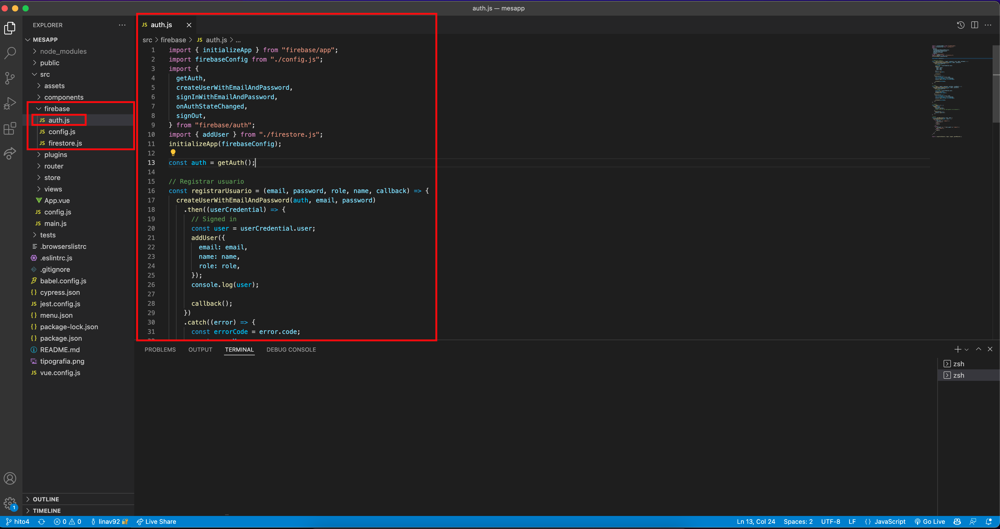
Nuestro proyecto implica que al crear un usuario este se pueda autenticar, se hace una conexión entre auth y el *Firestore* con la columna `users` 
**Auth desde Firebase**
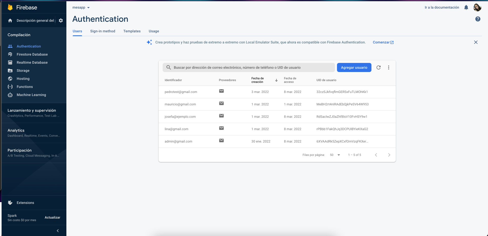
**Columna Users desde Firestore**
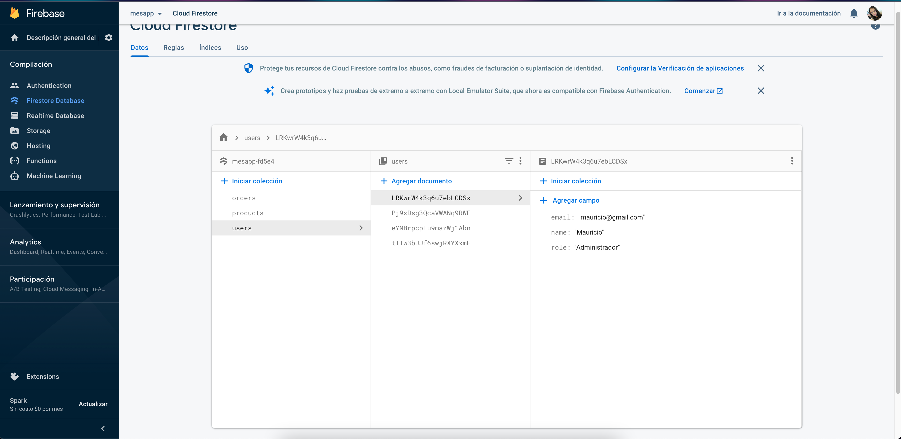

**Persistencia del estado de autenticación del usuario**
Persistencia de autenticación usuario *Administrador*
- Página QR
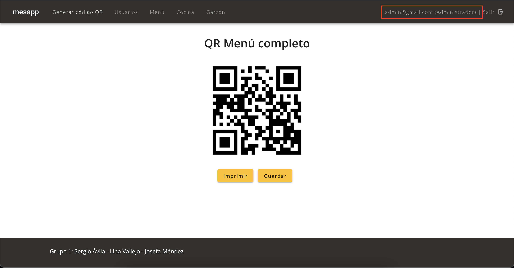
- Vista de Usuarios
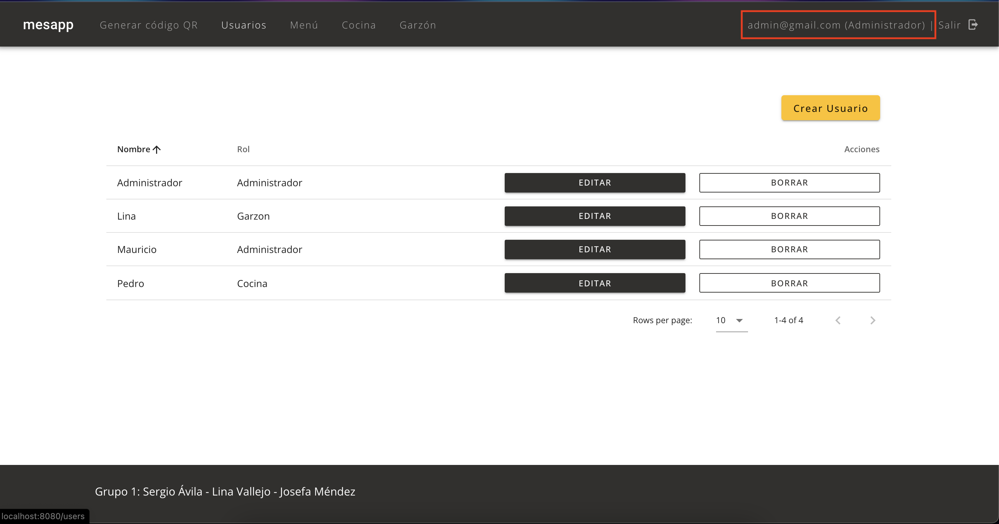
- Vista de Productos
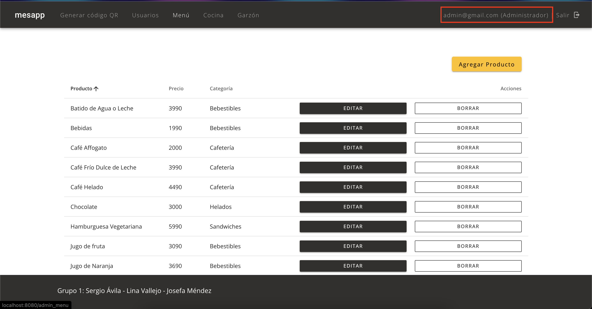
- Vista de Orders
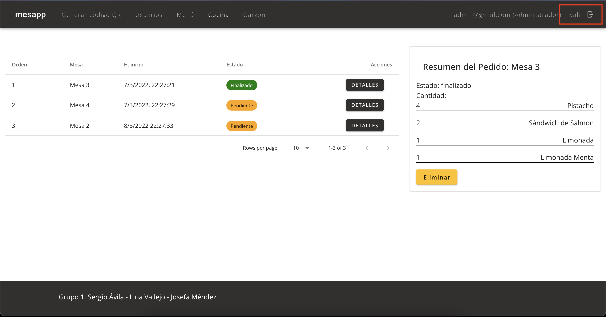
- Vista de Cocina
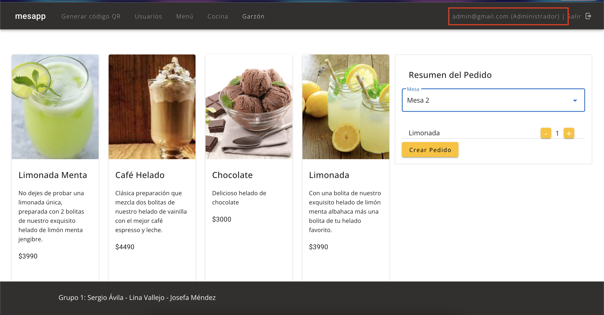

**Manejo de rutas según estado de autenticación**
Las rutas según la autenticación son:
- Para Administrador: Generador QR, Usuarios, Productos, Garzón y Cocina
- Para Garzón: Generador QR y Garzón
- Para Cocina: Generador QR y Cocina

**Opción de Cerrar Sesión**
Todos los roles tienen permitido cerrar sesión
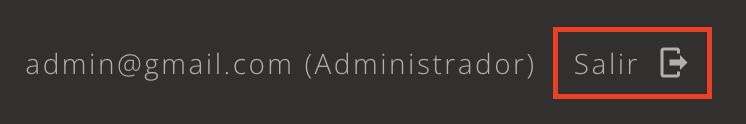

El código de cerrar sesión se encuentra en `src/firebase/auth.js`
```
const logout = () => {
  signOut(auth)
    .then((user) => {
      console.log(user);
      //Swal.fire("Te has deslogeado correctamente");
    })
    .catch((error) => {
      console.log(error);
    });
};
```
 y en `src/components/Navbar.vue`
 ```
   <v-toolbar-items v-if="auth">
        <v-btn id="logOutBtn" @click="logout" plain elevation="0">
          {{ userEmail }} ({{ userRole }}) | Salir
          <v-icon right dark> mdi-logout </v-icon>
        </v-btn>
      </v-toolbar-items>
    </v-app-bar>
    ...
<script>
import { logout } from "../firebase/auth.js";
export default {
  data: () => ({
    drawer: false,
    group: null,
    auth: false,
    role: "",
  }),
  methods: {
    logout() {
      logout();
      this.$store.commit("eraseEmail");
      this.$swal(
        "Te has deslogeado correctamente",
        "Nos vemos la próxima vez",
        "success"
      );
    },
    setAuthState() {
      if (this.userEmail == "") {
        this.auth = false;
      } else {
        this.auth = true;
      }
    },
  },
</script>
```
**Creación de usuarios**
Existen 3 usuarios creados actualmente:
1. admin@gmail.com para usuario admin
2. lina@gmail.com para usuario garzon
3. PedroTest@gmail.com para usuario cocina

Para crear más usuarios, solo puede hacerse desde la cuenta administrador


# Hito 4 ✏️
La aplicación deberá superar con éxito todos los test programados y se revisará que los test escritos realmente contemplen todo el funcionamiento de la aplicación.

Una vez finalizado el proceso de pruebas, se empaquetará la aplicación para su paso a producción.
Esta será alojada en un servicio de hosting a elección. Dentro de las opciones sugeridas se
encuentran Firebase hosting, GIthub Pages y Netlify.

1. Escritura de tests para probar la aplicación completa.
2. Alojamiento de la aplicación en un servicio de Hosting

**Escritura de test de la aplicación completa**
Todos los test se realizaron con el login y logout realizando el flujo completo, para la revisión del correcto funcionamiento del test se sugiere *eliminar las cookies del historial del navegador* de `Cypress`
Para el proyecto generamos los siguientes test:
***Login Success***
```
describe("Test logIn exitoso", () => {
  it('Se debe poder logear exitosamente y llegar a la vista qr y deslogear luego de 10s"', () => {
    // cy.clearLocalStorage();
    // cy.clearCookies();

    cy.visit("/admin");
    cy.contains("h1", "Iniciar Sesión");

    cy.get("#usuarioLabel").type("admin@gmail.com");
    cy.get("#passwordLabel").type("123456");
    cy.get("#LogInButton").click();

    cy.url().should("eq", "http://localhost:8080/qr");
    cy.contains("h1", "QR Menú completo");
    cy.wait(5000);

    cy.get("#logOutBtn").click();
    cy.wait(3000);

    cy.get(
      "button.swal2-confirm.sweet-alert-button.swal2-styled.swal2-default-outline"
    ).click();
  });
});
```
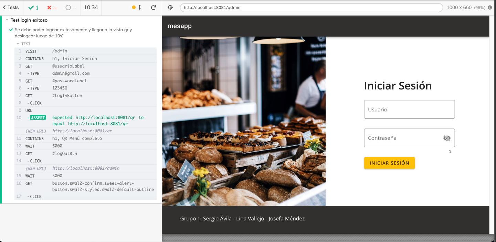

***Error del Login***
```
describe("Test usuario Inexistentes", () => {
  it('Se debe levantar el alert de "El mail es incorrecto"', () => {
    cy.visit("/admin");
    cy.contains("h1", "Iniciar Sesión");

    cy.get("#usuarioLabel").type("EstoNoEsUnCorreo");
    cy.get("#passwordLabel").type("123456");
    cy.get("#LogInButton").click();
    cy.wait(5000);

    cy.get(".v-alert").should("exist");
  });

  it('Se debe levantar el alert de "El usuario no es correcto"', () => {
    cy.visit("/admin");
    cy.contains("h1", "Iniciar Sesión");

    cy.get("#usuarioLabel").type("test@noexiste.com");
    cy.get("#passwordLabel").type("123456");
    cy.get("#LogInButton").click();
    cy.wait(5000);

    cy.get(".v-alert").should("exist");
  });

  it('Se debe levantar el alert de "La contraseña es incorrecta"', () => {
    cy.visit("/admin");
    cy.contains("h1", "Iniciar Sesión");

    cy.get("#usuarioLabel").type("admin@gmail.com");
    cy.get("#passwordLabel").type("45678");
    cy.get("#LogInButton").click();
    cy.wait(5000);

    cy.get(".v-alert").should("exist");
  });
});
```
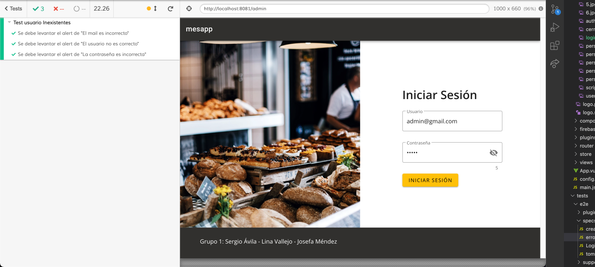

***createUser***
```
describe("Test que crea un usuario y lo valida iniciando sesión", () => {
  it("Se debe poder crear un usuario Marco, desplegar alerta de creado con exito y borrarlo", () => {
    cy.clearCookies();

    cy.visit("/admin");
    cy.contains("h1", "Iniciar Sesión");

    cy.get("#usuarioLabel").type("admin@gmail.com");
    cy.get("#passwordLabel").type("123456");
    cy.get("#LogInButton").click();

    cy.url().should("eq", "http://localhost:8080/qr");
    cy.contains("h1", "QR Menú completo");

    cy.get("#userMenuOption").click();
    cy.url().should("eq", "http://localhost:8080/users");

    cy.get(
      "button.mb-2.text-capitalize.v-btn.v-btn--is-elevated.v-btn--has-bg.theme--light.v-size--default"
    ).click();

    cy.get("#NameLabelUser").type("1_Ana");
    cy.get("#emailLabelUser").type("ana_ejemplo@gmail.com");
    cy.get("#passwordLabelUser").type("123456");
    cy.get("#selectLabelUser").click();
    cy.get("[role=listbox]").eq(1).click();
    // cy.get("div#list-item-162-1").click();

    cy.get("#btnCrearUsuario").click();

    cy.wait(3000);

    cy.get(
      "button.swal2-confirm.sweet-alert-button.swal2-styled.swal2-default-outline"
    ).click();

    cy.get("button.btn-borrar.v-btn.v-btn--outlined.theme--dark.v-size--small")
      .first()
      .click();

    cy.wait(3000);

    cy.get("#deleteUser").click();

    cy.wait(3000);

    cy.get("#logOutBtn").click();

    cy.get(
      "button.swal2-confirm.sweet-alert-button.swal2-styled.swal2-default-outline"
    ).click();
  });
});
```
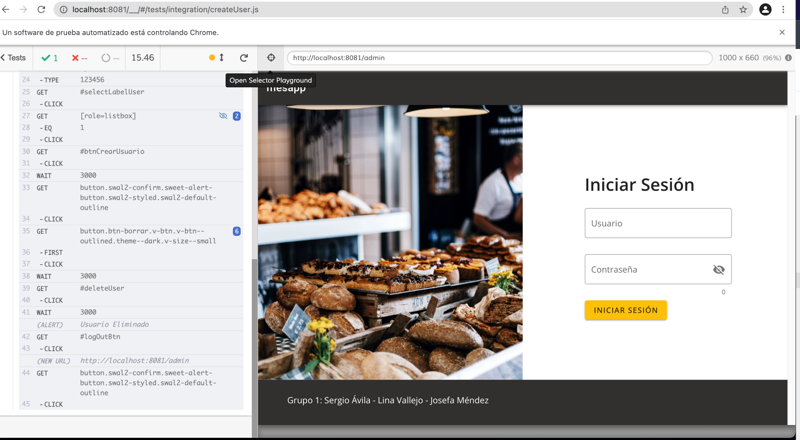

***tomarPedido***
```
describe("Test generar pedido de camarero", () => {
  it("Se debe poder crear un usuario Marco, desplegar alerta de creado con exito y borrarlo", () => {
    cy.clearCookies();

    cy.visit("/admin");
    cy.contains("h1", "Iniciar Sesión");

    cy.get("#usuarioLabel").type("admin@gmail.com");
    cy.get("#passwordLabel").type("123456");
    cy.get("#LogInButton").click();

    cy.url().should("eq", "http://localhost:8080/qr");
    cy.contains("h1", "QR Menú completo");

    cy.get("#garzonMenuOption").click();
    cy.url().should("eq", "http://localhost:8080/waiter");

    cy.get(
      "button.text-capitalize.v-btn.v-btn--is-elevated.v-btn--has-bg.theme--light.v-size--default"
    )
      .eq(6)
      .click();
    cy.get(
      "button.text-capitalize.v-btn.v-btn--is-elevated.v-btn--has-bg.theme--light.v-size--default"
    )
      .eq(11)
      .click();
    cy.get(
      "button.text-capitalize.v-btn.v-btn--is-elevated.v-btn--has-bg.theme--light.v-size--default"
    )
      .eq(7)
      .click();

    cy.get("div.v-select__selections").click();
    cy.get("[role=listbox]").eq(1).click();

    cy.get("button#agregarOtro").eq(2).click();
    cy.get("#confirmarPedido").click();

    cy.wait(3000);

    cy.get(
      "button.swal2-confirm.sweet-alert-button.swal2-styled.swal2-default-outline"
    ).click();

    cy.get("#cocinaMenuOption").click();
    cy.url().should("eq", "http://localhost:8080/kitchen");

    cy.get(
      "button.btn-editar.mr-5.v-btn.v-btn--is-elevated.v-btn--has-bg.theme--dark.v-size--small"
    )
      .eq(0)
      .click();

    cy.wait(5000);

    cy.get("#logOutBtn").click();

    cy.get(
      "button.swal2-confirm.sweet-alert-button.swal2-styled.swal2-default-outline"
    ).click();
  });
});
```
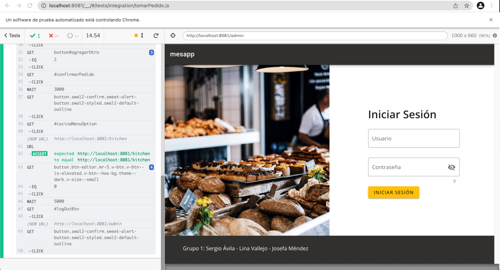

**Alojamiento de la aplicación**
Para el alojamiento hemos elegido `Netlify`[https://www.netlify.com/] como hosting y le agregamos el dominio `mesapp.cl`. Para permitir redirecciones para una SPA (Single Page Application) se debe agregar en la carpeta *public* un archivo de nombre *_redirects* dentro del proyecto el cual lleva lo siguiente:
```
/* /index.html 200
```

**Guía de instalación del proyecto**
_Project setup_

```
npm install
```

_Compiles and hot-reloads for development_

```
npm run serve
```

_Compiles and minifies for production_

```
npm run build
```

_Run your unit tests_

```
npm run test:unit
```

_Run your end-to-end tests_

```
npm run test:e2e
```

_Lints and fixes files_

```
npm run lint
```

_Customize configuration_
See [Configuration Reference](https://cli.vuejs.org/config/).

**Rutas de Acceso**
Por el momento estamos usando las rutas de ambiente de desarrollo. Las rutas existentes son:

- **_Administrativo_** Se encuentra todo lo que el admin puede realizar, puede visualizarlo ingresando a http://mesapp.cl/admin 
- **_El menú_** lo pueden visualizar ingresando a: http://mesapp.cl en donde el usuario final puede elegir que desea pedir.
- **_Garzón_** Se encuentra en: http://mesapp.cl/waiter aquí este puede tomar el pedido de los clientes.
- **_Cocina_** En esta vista podemos ver todos los pedidos recibidos en la cocina en http://mesapp.cl/kitchen que fueron creados por el garzón anteriormente.


### Aclaraciones 📋

La revisión del proyecto se debe hacer desde la rama `hito4` o en la rama `main` la cual tiene el proyecto completo y limpio.

# Construido con 🛠️

- Vue [2.6.11] - Framework usado
- Vuetify [2.4.0] - Framework de CSS usado
- Vue Router [3.2.0] - Librería de enrutamiento oficial de Vue
- Vuex [3.4.0] - Librería de gestión de estados
- Firebase [9.6.5] - Plataforma para la autenticación y Bases de datos
- Vue Sweetalert2 [5.0.2] - Librería para dar estilos a las alertas
- Cyperss [4.5.0] - End-To-End testing

## Autores ✒️

- **Josefa Mendez** - _Trabajo Inicial y documentación_ - [JoMendezG](https://github.com/JoMendezG)
- **Lina Sofía Vallejo Betancourth** - _Trabajo Inicial y documentación_ - [linav92](https://github.com/linav92)
- **Sergio Ávila Astorga** - _Trabajo Inicial y documentación_ - [sergioavila](https://github.com/sergioavila)

## Licencia 📄

Este proyecto es un software libre.
