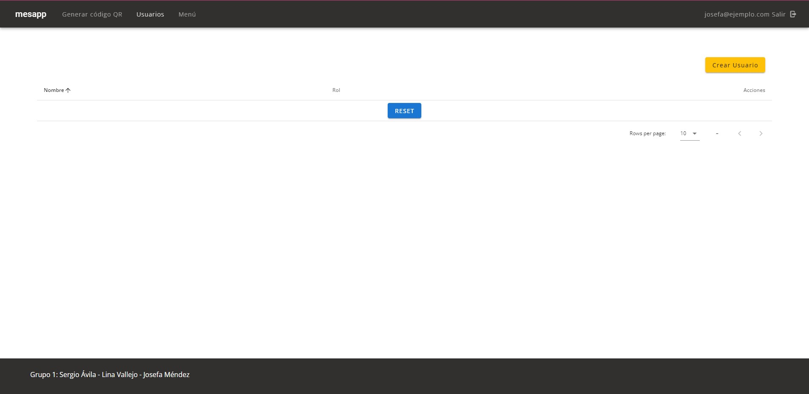
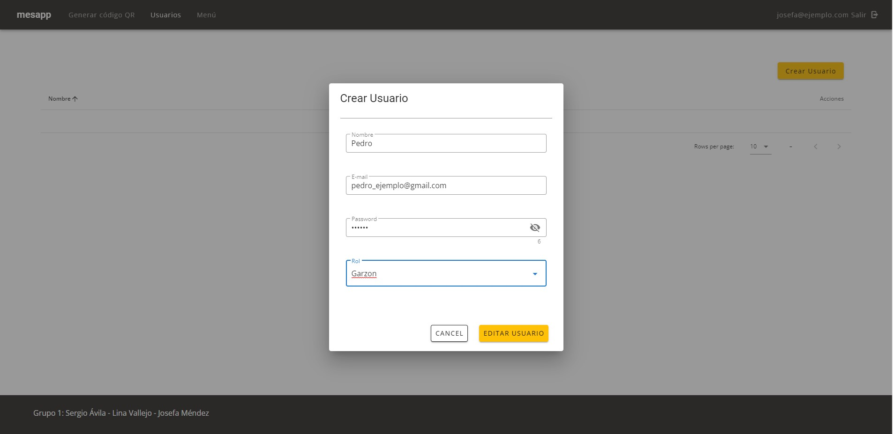
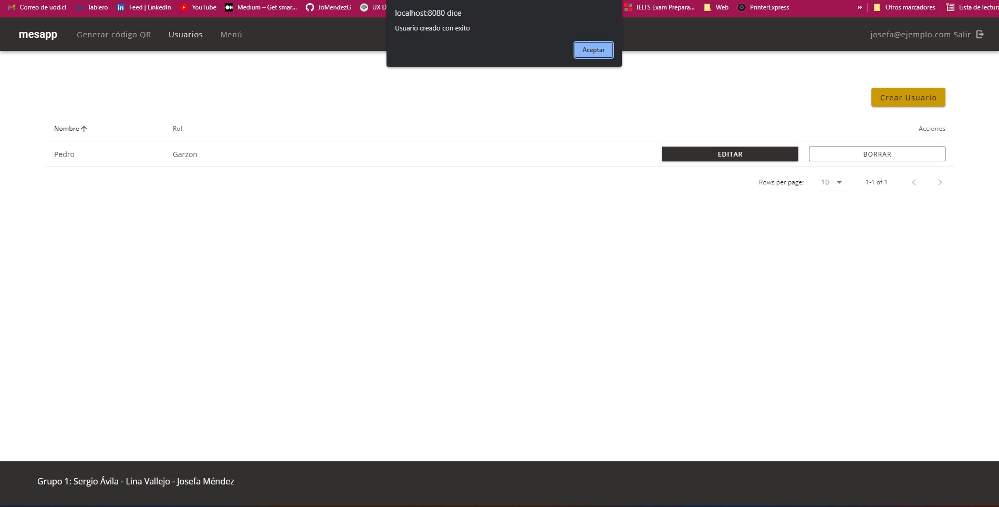
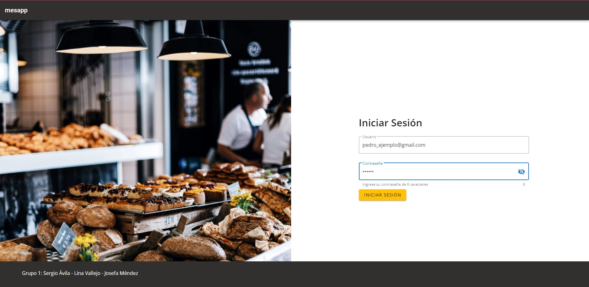
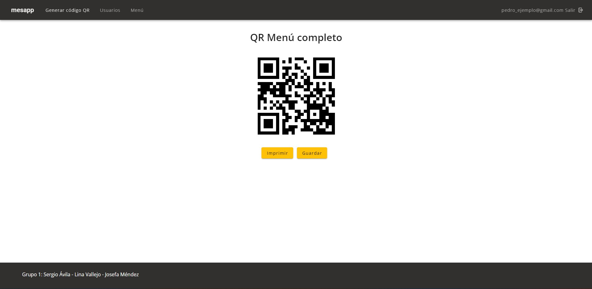

# Proyecto MesApp 🚀

- Sistema de administración de pedidos y generador de menú por medio de códigos QR

## Pre-requisitos 📋

Se requiere la previa instalación del framework Vue con las librerías Vuex, Vue-Router, Firebase y Vuetify

# Hito 1 📦

## Maquetación

El primer Hito consiste en la maquetación del proyecto, para lo cual, primero es necesario definir el tema y orientar el diseño que tendrá la interfaz. En esta etapa, se montará el entorno de desarrollo necesario y se trabajará de una forma más bien estática, generando las vistas y componentes que formarán parte de la aplicación.

1. Descripción del proyecto: Descripción breve, propósito de la aplicación y usuarios a los que apunta
2. Guía de estilos: Una breve guía de estilos que indique tipografías utilizadas (recomendado
   utilizar desde Google fonts), tamaños de texto, colores seleccionados y que elementos harán
   uso de ellas.
3. Guía de instalación del proyecto: Indicar los requisitos necesarios, si se utiliza Webpack o Parcel, si es necesario instalar dependencias extra dentro de un directorio (Por ejemplo, para las Cloud Functions). Registrar paso a paso el proceso de instalación.
4. Rutas de acceso: Indicar la ruta en donde puede ser encontrada la aplicación

**Descripción y proósito del proyecto**
MesaApp es un sistema de administración de pedidos y generador de menú por medio de códigos QR para cafeterías, el cual permite facilitar la vista del menú para el comensal gracias a un sitio web responsivo cuyo acceso es gracias a un código QR. En tanto a la administración, proporciona información para el gerente de la cafeteria; gracias a su sistema de reporte y fácil uso de creacion y eliminacion de productos, usuarios y categorías.

La proyección del proyecto es para un solo cliente.

**Usuarios**
Los usuarios a los que apunta este proyecto son:

1. **_Administrador:_** Encargado de crear, actualizar, eliminar productos, categorys y usuarios (garzones), puede verificar el reporte y genera el código QR del menú.
2. **_Garzón:_** Actualiza y elimina productos de un pedido.
3. **_Cocina:_** Encargado de revisar y enviar el estado del producto (Creado a Finalizado).
4. **_Comensal/Usuario anónimo:_** Usuario final, puede ver el producto gracias al sistema de QR

El administrador es el único en conocer la ruta del sistema de administración

**Guía de Estilos**
**_Colores y tipografía_**
La siguiente imagen es la guía de estilos propuesto.


**_Maqueta_**
Para la realización de la maqueta definimos la herramienta figma, puede encontrar el detalle en el siguiente enlace:
https://www.figma.com/proto/YYYSx3DrT7EYjLYLVgrYfU/Coffee-APP?node-id=0%3A1&scaling=min-zoom&page-id=0%3A1
**_Resultado_**
El resultado que deseamos obtener del proyecto se encuentra en el siguiente enlace, de aquí nos guiamos en el diseño gráfico propuesto.
https://xd.adobe.com/view/d90c3c28-3536-4d31-a985-3f1b7d7b39a9-8c5f/

# Hito 2 🧺

## Datos y Lógica

El segundo Hito consiste en la obtención de datos y el desarrollo de la lógica que controlará a la aplicación, el manejo del estado y la comunicación entre componentes para crear una interfaz dinámica.

1. Conexión con API: en la vista /qr podemos ver como se genera un qr se podra guardar e imprimir para que los restaurantes puedan excibir su menú a los clientes.
2. Conexión con Vuex: Dentro del proyecto tenemos 2 conecciones realizadas con vuex:

- Creación de usuarios del restaurante, tales como garzón, administrador o cocinero.
- Creación de productos que se vinculan al menú del restaurante.

3. Como bonus de avance se pueden ver algunos de avances de firebase, tales como la autentificación, creación de usuario y producto, junto con su edición correspondiente.

**Flujo de creación de usuario**

- En la vista de usuarios realizamos click en el botón de **crear usuario**
  

- Rellenamos todos los campos
  
  

- Guardamos y vemos como ahora en nuestra vista de usuarios tenemos la alert que confirma la creación de usuario y este en el listado de usuarios.
  

- Para probar la conección, nos deslogueamos y probamos iniciar sesión con este nuevo usuario.
  

- Finalmente vemos que todo funciona al entrar a la vista inicial del qr. Además podemos confirmar el usuario en la esquina superior derecha.
  

**Guía de instalación del proyecto**
_Project setup_

```
npm install
```

_Compiles and hot-reloads for development_

```
npm run serve
```

_Compiles and minifies for production_

```
npm run build
```

_Run your unit tests_

```
npm run test:unit
```

_Run your end-to-end tests_

```
npm run test:e2e
```

_Lints and fixes files_

```
npm run lint
```

_Customize configuration_
See [Configuration Reference](https://cli.vuejs.org/config/).

**Rutas de Acceso**
Por el momento estamos usando las rutas de ambiente de desarrollo. Las rutas existentes son:

- **_Administrativo_** Se encuentra todo lo que el admin puede realizar, puede visualizarlo ingresando a http://localhost:8080/admin (aún en etapa de desarrollo)
- **_El menú_** lo pueden visualizar ingresando a: http://localhost:8080/ en donde el usuario final puede elegir que desea pedir.
- **_Garzón_** Se encuentra en: http://localhost:/8080/waiter aquí este puede tomar el pedido de los clientes.
- **_Cocina_** En esta vista podemos ver todos los pedidos recibidos en la cocina en http://localhost:/8080/kitchen que fueron creados por el garzón anteriormente.

### Aclaraciones 📋

La revisión del proyecto se debe hacer desde la rama `hito1`, en la rama `main` solo se verá el proyecto una vez realizado los cambios de acuerdo a las sugerencias hechas por parte del profesor y el ayudante.

# Construido con 🛠️

- Vue [2.6.11] - Framework usado
- Vuetify [2.4.0] - Framework de CSS usado
- Vue Router [3.2.0] - Librería de enrutamiento oficial de Vue
- Vuex [3.4.0] - Librería de gestión de estados
- Firebase [9.6.5] - Plataforma para la autenticación y Bases de datos

## Autores ✒️

- **Josefa Mendez** - _Trabajo Inicial y documentación_ - [JoMendezG](https://github.com/JoMendezG)
- **Lina Sofía Vallejo Betancourth** - _Trabajo Inicial y documentación_ - [linav92](https://github.com/linav92)
- **Sergio Ávila Astorga** - _Trabajo Inicial y documentación_ - [sergioavila](https://github.com/sergioavila)

## Licencia 📄

Este proyecto es un software libre.
